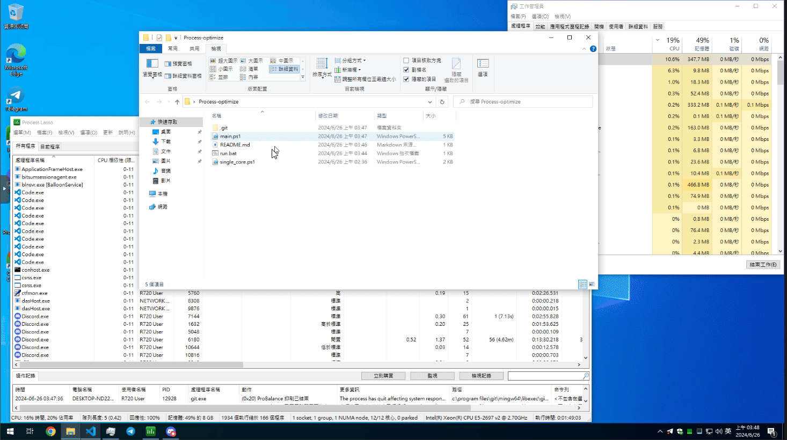

# 如何使用
1. 僅支援 Windows none-support EPYC CPU yet
2. 可以自訂要監控的處理程序名稱，設定好你要限制執行續的處理程序
```
param (
    # 是否開啟顯示當前監控所有進程資訊(預設開啟)
    # [switch]$ShowProcessInfo = $true
    # 如果不要有週期性顯示當前監控的所有進程資訊則把上面的註解，然後取消註解下方的指令
    [switch]$ShowProcessInfo = $false
)

# 設定要監測的進程名稱(預設:針對 edge 的 webview2)
$processName = "msedgewebview2"
# 這是範例可以限制你已知道的 exe 檔名即可，無須添加副檔名.exe
# $processName = "chrome"

# 設定檢查間隔時間（秒）
# 設定多久(週期)檢查一次執行中的進程
$interval = 5
```
3. 執行 run.bat


# DEMO

